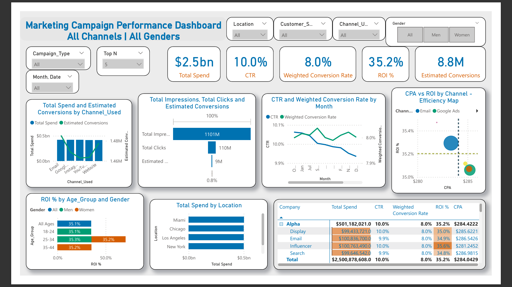

# 📢 Marketing Campaign Performance Dashboard (Power BI)

📊 **Tools Used**: Power BI | Kaggle Dataset  

---
## Table of Contents
- [Project Overview](#project-overview)
- [Data Structure](#data-structure)
- [Methodology](#methodology)
- [Key Insights](#key-insights)  

---
## Project Overview  
This project presents a **Marketing Campaign Performance Dashboard** built in Power BI.  
It provides **interactive insights across channels, customer segments, gender, and locations**, helping stakeholders evaluate **spend efficiency, conversions, ROI, and CTR performance**.  

---

## Data Structure  
Features include:  
- Campaign Type & Channel Used  
- Spend & Estimated Conversions  
- Click-Through Rate (CTR)  
- Conversion Rate & ROI %  
- Customer Segments, Age Group, and Gender-based performance  
- Location-wise spend and efficiency metrics  

---

## 📂 Project Files  
- `Marketing campaign performance dashboard.pbix` → Power BI dashboard file
- Dataset: [Marketing Campaign Performance Dataset (Kaggle)](https://www.kaggle.com/datasets/manishabhatt22/marketing-campaign-performance-dataset)  
- `README.md` → Project documentation  
- `Insights_Report.md` → Detailed insights & recommendations  
- 📸 Dashboard screenshot (see below)  

---

## Methodology  
1. **Data Cleaning & Preparation**
   - Handled missing or inconsistent campaign entries.  
   - Verified data types for Spend, CTR, and ROI%.  
   - Created calculated measures for **CPA (Cost per Acquisition)** and **Weighted Conversion Rate**.

2. **Dashboard Design**
   - Built interactive slicers for **Channel**, **Campaign Type**, **Gender**, **Location**, and **Date**.  
   - Designed key KPIs:  
     - **Total Spend** – $2.5B  
     - **CTR** – 10%  
     - **Weighted Conversion Rate** – 8%  
     - **ROI** – 35.2%  
     - **Estimated Conversions** – 8.8M  
   - Included performance visuals for:  
     - Total spend by **Channel Used**  
     - CTR & Conversion trends by **Month**  
     - ROI % by **Age Group** and **Gender**  
     - Efficiency Map (CPA vs ROI%)  
     - Spend distribution by **Location**

3. **Insights Extraction**
   - Identified top-performing channels and locations.  
   - Compared campaign efficiency across genders and age groups.  
   - Visualized ROI performance to guide strategic spend allocation.  

---

## Key Insights  
- **Google Ads** & **Email** delivered the highest ROI efficiency. 
- **Age groups 25–34** and **35–44** showed strongest ROI (35%+).
- High spending in **Miami, Chicago, Los Angeles, and New York**. 
- CTR remained stable around 10%, but Weighted Conversion Rate showed a decline in later months.

- For a deeper breakdown of campaign performance, view the complete [Insights Report](insights.md).
---
## Dashboard Preview  

---

## 🚀 Business Impact  
- Enabled **data-driven optimization** of campaign spend across channels.  
- Helped marketing teams identify **low-performing campaigns** for reallocation.  
- Improved transparency of performance metrics for stakeholders and management.

---
## 🚀 How to Use the Dashboard  
1. Download the `.pbix` file from this repository.  
2. Open it in **Power BI Desktop** (free).  
3. Load the Kaggle dataset.  
4. Explore interactive visuals and filters (Channel, Gender, Location, Campaign Type, etc.).  

---

## 📫 Connect with Me  
- [LinkedIn](https://www.linkedin.com/in/soorya-k-s-/)  
- 📧 Email: **sooryaks552@gmail.com**  

⭐️ From [Sooryaks237](https://github.com/Sooryaks237)  
